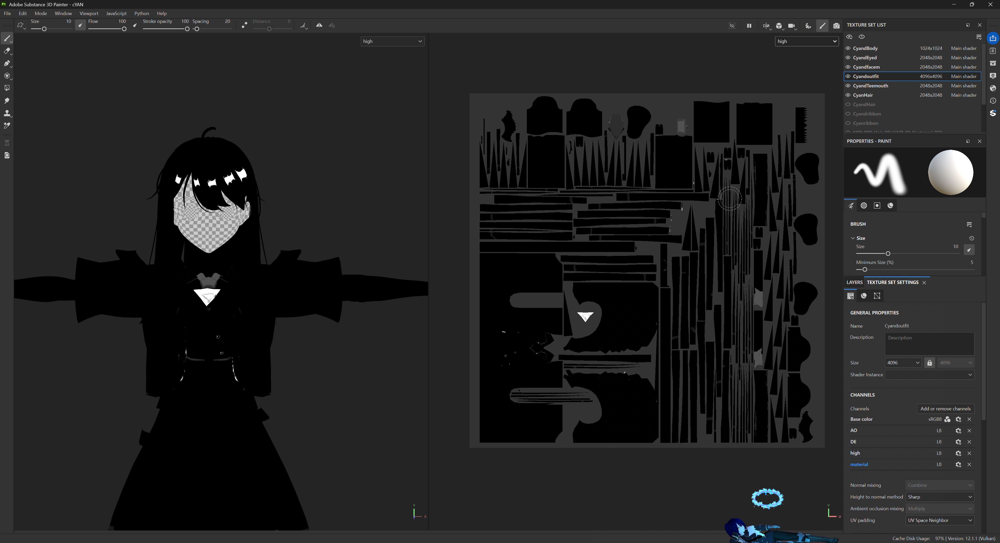
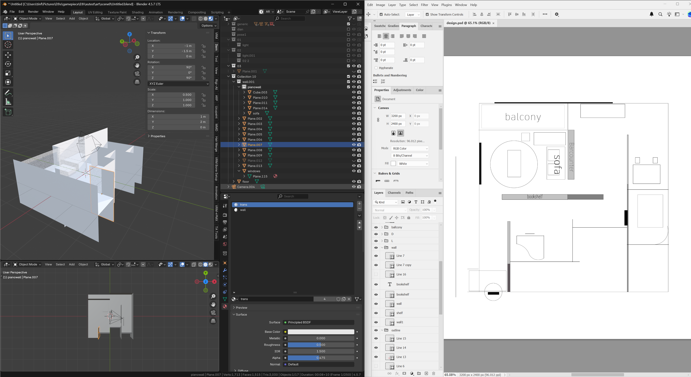

# ねんの部屋 · 场景设计文档

> 《晴雨》中怜的家。一个低饱和、青灰色、阴雨天为主调的数字空间。
> 为角色设定与剧情服务，长期迭代。

---

## 一、项目概览

| 项 | 内容 |
|---|---|
| 项目名 | 怜の部屋 |
| 原作 | 小说《晴雨》 |
| 类型 | 3D 数字场景 / 简化版 VRChat 模式交互 |
| 引擎 | Unity（自定义 Render Pipeline，多材质卡渲） |
| 渲染 | 风格化卡渲（ramp 光照 / SH 间接光 / rim light） |
| 核心意象 | **雨** |
| 范围 | 起居室 + 卧室（封闭空间） |
| 目标 | 角色设定与剧情服务，叙事向优先 |

**氛围定位：** 日系现代、低饱和、青灰调、阴雨天。空间大而空，光为唯一情绪。

---

[最终 vrchat 参考](video/2026-09-2423-50-15.mp4)

## 二、范围与边界

### 做
- 起居室 + 卧室
- 雨痕玻璃、钢琴区、落地窗、玄关、卧室
- 基础交互：拿起放下、钢琴靠近发声、镜子（RT 固定反射）

### 不做
- 餐厅、厨房、卫生间（比赛版本不涉及）
- 实时镜子、复杂 UI 面板
- 完整房屋（后续主线可扩展）

### 边界声明
- 贴图仅定义材质固有属性（BaseColor / AO / 金属度 / 细节遮罩）
- 最终光照、阴影、氛围由 Unity 端统一控制
- 参考 VRChat 地图时，参考的是空间构图与氛围方向，不是贴图复现

---

## 三、核心意象：雨

> 「水滴，亦或是说水痕在窗玻璃上爬行、蔓延。」
> 「天是青灰色的。」
> 「青灰色的世界。」

雨是这个空间的底色。所有视觉决策优先服务于此：
- 天光为主光源，阴雨散射，青灰偏冷
- 室内几乎不开灯，只有电子设备微光
- 玻璃是边界，也是出口（梦境中白霜拉着怜冲向落地玻璃）

---

## 四、空间划分思路

参考：《室内空间设计手册》nLDK 划分。

本项目聚焦 **L（起居室）+ 卧室**。

### 设计要点
- 部分墙体使用**浅灰 + 深灰遮挡**，起空间分割作用
- 浅灰色 / 透明材质部分用作**大书架、架子**——不完全隔断，但仍分割空间
- 钢琴是「黑色巨物」，**挡在动线上**，怜需要绕开它走
- 落地玻璃是梦境出口，也是日常俯瞰小学的窗口

### 待解决问题
- 钢琴尺寸与空间划分对不上（钢琴尚未放入 DCC）
- 墙壁厚度、纹理、透明部分需进一步明确
- 阴影问题待处理

---

## 五、交互设计

| 交互 | 状态 | 说明 |
|---|---|---|
| 拿起放下 | ✅ 完成 | 最基础交互 |
| 钢琴靠近发声 | ✅ 完成 | 录制时音效消失，待查 |
| 雨痕玻璃 | ✅ 完成 | 核心氛围 |
| 镜子 | ⚠️ RT 固定反射 | 实时方案砍掉 |
| 翻盖相机 | ⚠️ 半完成 | 有问题，非核心 |
| UI | ❌ 砍 | 不为 UI 消耗精力 |
| 冰箱动画状态机 | 待定 | 视范围调整 |

**原则：** 不做复杂策划，不为 UI 消耗精力。交互服务氛围，不服务玩法。

---

## 六、贴图制作规范（SP 外包用）

### 每件家具需要

1. **BaseColor 贴图**（RGBA，.tga）
   - RGB = 基础色（平涂，不写实）
   - A = 材质 ID（0=金属，1=非金属，≈0.52=非金属默认）

2. **LightMap 贴图**（RGBA，.tga）
   - R = AO
   - G = Details（绒毛等相关）
   - B = High（高光，是否被光点亮）
   - A = 金属度（0 or 1 金属，0.5 非金属）

参考sp材质
每种家具需要一张rgba的lightmap贴图(.tga)
 rgba各为灰度
lightmap r: ao

lightmap g: details（类似绒毛相关）

ligtmap b: high（高光，是否被光点亮）

lightmap a: 金属度体现(0 or 1金属，0.5非金属)

进阶（可选）：UV 孤岛整合打包、烘焙。

### Painting Recipes（归一化 0.0–1.0）

| Material | R | G | B | A | Notes |
|---|---|---|---|---|---|
| Cotton / wool / matte fabric | 1.0 | ~0.43–0.51 | 0.0 | non-metal (≈0.52) | No specular. R 可在褶皱处画暗（AO） |
| Denim | 1.0 | ~0.39–0.43 | ~0.06–0.12 | non-metal | 阴影略宽，微弱高光 |
| Satin / silk | 1.0 | ~0.47–0.50 | ~0.24–0.39 | non-metal | 宽而柔的高光 |
| Leather | ~0.90 | ~0.35–0.43 | ~0.35–0.51 | non-metal | 高光较窄，过宽调 `_SpecularExpon` |
| Latex / PVC | 1.0 | ~0.50 | 1.0 | non-metal | 最强非金属高光 |
| **Metal** | 1.0 | ~0.50 | **1.0** | **0 or 1** | 高光被 BaseColor 染色，金属色画在 BaseColor |

> Ramp 逻辑暂时忽略。

### 边界声明
贴图仅定义材质固有属性。最终光照、阴影、氛围由 Unity 端统一控制。画手无需考虑全局光影。

---

## 七、协作说明

本项目为个人长期项目。部分模块（贴图、音乐）外包协作。

### 对接方式
- **源文档：** 本仓库（GitHub）
- **对接层：** GitHub Issues / Discussions，或飞书独立文档
- **原则：** 每个合作者一份独立对接文档，不混在一起

### 当前需求
- **SP 贴图：** 按第六节规范绘制家具贴图（按件计）
- **音乐：** 10.8 前交付一首（需求后续分发）

### 合作边界
- 按件交付，交付即结束
- 不反复改，不无限迭代
- 最终画面效果由项目端负责，不归因于贴图质量

---

## 八、进度日志

### 9.24

今晚熬夜 收集好参考视频、vrchat 参考、探索下上限。

- 雨痕玻璃 [完成]
- 镜子交互测试: UI 只有开/关 [无。有思路，C# 沟通客户端 Rt 传来传去很麻烦]
- 相机交互测试 [半完成，有些问题]

总结：完成度有点差，原先钢琴靠近是有每个音的声音的。不知为什么录制时又没有了。

[9.24 第一天探索 demo](video/Movie_001.mp4)

[理论上可以实现的](video/2026-09-2503-18-26.mp4)

总结:
1. UI 交互问题不解决其他大概会被拖死。考虑摇人。需求就是上面的部分。
2. 做项目需要找人 sp 画贴图。考虑摇人。(而且还要根据家具量决定。)需要会用 sp，看懂 shader，材质选择能力（？不过这样好像就得默认知道 ao、gbuffer 一系列 rgb 合并等各种）。能自己 unity 调试。

---

### 9.25

次都被 ui 拖死我也真是

室内平面和空间划分学到很多东西...

问题: 钢琴尺寸等相关，空间要重新划分
空间划分完后细节填入等，墙壁 -> 厚度 -> 纹理 透明部分 -> 书柜
影子问题。。。阴影。。

#### 说明

1. 文件夹 nLDK L 起居室 D 餐厅 K 厨房划分 n 房间（参考[《室内空间设计手册》](https://zlib.bz/book/rEMX0p5W1m/%E5%AE%A4%E5%86%85%E7%A9%BA%E9%97%B4%E8%AE%BE%E8%AE%A1%E6%89%8B%E5%86%8C.html)）
2. 我的一些设计思路: 一些墙（如设计图浅灰 + 深灰的遮挡作用，浅灰色（以及 demo 里透明材质部分是用作比较大的书架、架子，没有完全隔断但依然起到空间分割作用））
3. D，toilet 部分项目比赛应该不会做到。

但是项目应该只聚焦起居室 + 卧室。封闭好空间结束。

问题: 还是有些空间划分得有问题。和钢琴尺寸对不上（由于我钢琴还没来得及放 dcc 导致。。所以上面设计图尺寸也不太对（因为同时在引擎里面调整地编手感这一块。。奇幻。））

[9.25 demo process](video/2026-09-2518-19-48.mp4)

[shader parameter adjust](video/2026-09-2518-12-56.mp4)

- 天空盒需要精修: 加底层模糊照片
- 确定好范围后再 -> 家具选取、摆放
- 钢琴材质贴图可以外包了

超计划完成但不能达到很好（80 分）的阶段感觉。

---

### 9.26

确定好范围后、墙壁厚度设置好再 ->

音乐需求在后分发

---

### 9.27

交互相关

最基础:
- 拿起放下 (完成) -> 拍照交互 -> 冰箱复杂动画状态机交互
- 钢琴靠近有声音 (完成)
- 镜子 (完成) -> UI

---

### 9.28 - 10.1

划分好空间区域、设计室内引导、家具摆放（根据 27 号调整）

挑选可交互物品（根据明天情况看涉及 diffuse、transprent、half-transparent 中）整合到 blender 中

挑选可交互物品这中间我可以 ai 工具一键上一些功能、但是资产导入导出需要筛选模型优化调整相关，还有 shader 改写。这个我打算外包出去。但我不知道是到时候找人还是，我有个朋友是可以提前和她打个招呼来着。

---

### 10.1 - 10.3

（根据 27 号后实时调整）

10.8 日前交付一首音乐即可

室内（这个得划定区域，应该不会很大。我估计跟一个宿舍差不多的大小（参考一些 vrchat 地图。）

参考视频：
音乐参考：

---

## 相关描写

[第一段]

某天早上，我很困，外面在下雨，空气中氤氲着水汽，屋子里也洋溢着潮湿厚重的味道....天是青灰色的，要不是手表在枕边一闪一闪，我都没意识到已经白天了。

不想起床....下雨天最好睡觉了。

但某人貌似...从昨天开始就一副「今天我要告诉你一个好消息，但是个秘密」的神奇状态，以及还「无意识」在我面前排出了几张皱巴巴的五线谱，还特意补了一句「只说给你听」。

自己也就不知觉滚下床、做好洗漱相关、关掉空气净化器后看了眼苏阿姨在电话手表里留言后就出门了。

水滴，亦或是说水痕在窗玻璃上爬行、蔓延。我时常通过这扇玻璃看外面，平时，从这里就能俯瞰到我们小学，能看到白霜把球和球拍打上去的那棵树.....而今天什么也看不见，青灰色的世界。

「哗....————....」

靴子在斑驳砖块和泥水洼间高高低低踏着着，踩过散落一地的、如同粉末一样的桂花花瓣，即使这样，它们的香气仍旧浓郁。经过深水洼时，我小心拎起雨衣，又放下。再避开赶路的人、飞驰的车.....我盯着铁门栏外的方向。

远远地，我终于看见白霜，她在远处转她伞，那把红色的印有卡通图案的伞，在青灰色的天际与人流间极度明艳，她搓着抛起来，然后再接住，非常轻盈。其实她有时也没接住，她没穿雨衣，好像完全无所谓，但我不喜欢被淋着湿漉漉的...于是我立刻冲过去，想提醒她。

（....中间省略一部分。然后接续）

于是我也有些好奇，我也就向阿姨提出这些，她倒一副「随便我」的态度，然后继续她的各种出差。

自从家里凭空多出来一架黑色巨物后，需要我改掉老习惯，滚下床后得绕开它走，要么远远地观察它，非常后悔当初提出了这件事情。但是这个陌生的大东西不像用完的修正带可以随便扔掉。它的颜色也很单调。除此外，每周日下午，我还要应付一个无聊的陌生人。

所以，「你可以来我家弹钢琴。」我向她伸手，指向我家方向。

那应该是白霜第一次来我家玩吧，现在看来，那时的她大概不会喜欢我家这样低饱和的颜色、更不会喜欢这样毫无生活气息的....家？

「哇.....」她平息凝神，非常小心翼翼，「我穿哪个...?」她问我，指了指鞋柜。

「随便，穿哪个都行。」

结果她没有穿鞋，穿着袜子小心移动着，向我招手示意：「你家有大人在吗....」

我摇摇头。

她好像松了一口气，一蹦一跳向钢琴的方向前去。

「好哎....」她迫不及待打开琴盖，翻出她包里的谱子，高高低低地摁着琴键。

不连续的、间断的乐曲想起，融化在微微潮湿的空气中，水中溶解了糖，空间并没有什么变化，但又貌似填上了某种空隙。

[第二段摘取自梦境片段]

白霜突然抓紧我的手，我趔趄两步、差点摔倒，她拉着我，向家里那些落地玻璃冲去，我立刻闭眼。

……预想的疼痛并没有发生，随之而来的只有哗啦哗啦玻璃破碎的声音、自然下坠，自由落体的“感觉”、以及渐渐减速、又滑翔向上升起、向前远远跃去的，灰色世界中飞翔的白霜。

这个角色大概的生活习惯是比较困、爱睡、..习性像猫、家里不养宠物